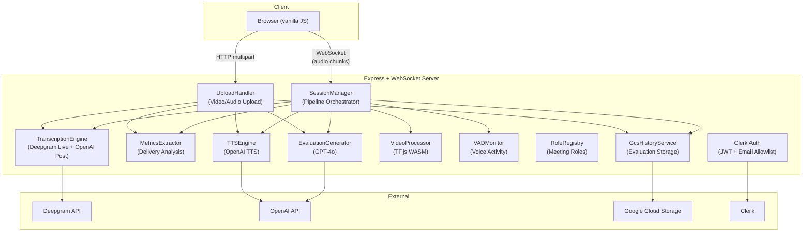

# Architecture Overview

> Living document — update when the system's structure changes.

## System Summary

AI Speech Evaluator is a **single-server** Node.js application that captures live speech (via WebSocket), processes recorded/uploaded audio+video, and returns AI-generated evaluations via TTS. It serves a **single-page frontend** (vanilla HTML/CSS/JS, no build system) over Express.

**Deployment**: Docker container on Google Cloud Run (northamerica-northeast1)
**Domain**: eval.taverns.red

---

## Architecture Diagram



---

## Component Inventory

### Core Pipeline

| Component | File | Responsibility | Dependencies |
|-----------|------|---------------|-------------|
| **SessionManager** | `session-manager.ts` | Orchestrates the full pipeline: consent → record → transcribe → metrics → eval → TTS | All pipeline components |
| **TranscriptionEngine** | `transcription-engine.ts` | Live (Deepgram WS) + post-speech (OpenAI Whisper) transcription | Deepgram SDK, OpenAI |
| **MetricsExtractor** | `metrics-extractor.ts` | Computes delivery metrics: WPM, filler words, pauses, energy, pitch | None (pure computation) |
| **EvaluationGenerator** | `evaluation-generator.ts` | Generates structured evaluations via GPT-4o | OpenAI |
| **TTSEngine** | `tts-engine.ts` | Converts evaluation text to speech | OpenAI TTS |

### Media Processing

| Component | File | Responsibility | Dependencies |
|-----------|------|---------------|-------------|
| **VideoProcessor** | `video-processor.ts` | Extracts frames, detects faces/poses | TF.js, sharp, ffmpeg |
| **FrameExtractor** | `frame-extractor.ts` | Pulls frames from video at intervals | fluent-ffmpeg |
| **FrameSampler** | `frame-sampler.ts` | Selects representative frames | None |
| **VADMonitor** | `vad-monitor.ts` | Voice activity detection for silence timing | None (energy-based) |

### Storage & History

| Component | File | Responsibility | Dependencies |
|-----------|------|---------------|-------------|
| **GcsHistoryService** | `gcs-history.ts` | Save/list/delete evaluations in GCS | @google-cloud/storage |
| **GCSUploadService** | `gcs-upload.ts` | Two-phase video upload to GCS | @google-cloud/storage |
| **FilePersistence** | `file-persistence.ts` | Local file output (legacy) | fs |
| **Retention** | `retention.ts` | Automatic data retention sweeps | GcsHistoryClient |

### Auth & Roles

| Component | File | Responsibility | Dependencies |
|-----------|------|---------------|-------------|
| **AuthMiddleware** | `auth-middleware.ts` | Clerk JWT verification + email allowlist | @clerk/express |
| **RoleRegistry** | `role-registry.ts` | Toastmasters meeting role definitions | None |
| **Roles** | `roles/*.ts` | Ah-Counter, Timer, Grammarian, etc. | None |

### Server & Infra

| Component | File | Responsibility | Dependencies |
|-----------|------|---------------|-------------|
| **Server** | `server.ts` | Express + WebSocket server, API routes | express, ws |
| **Logger** | `logger.ts` | Structured JSON logging (GCP-compatible) | None |
| **MetricsCollector** | `metrics-collector.ts` | Runtime metrics aggregation | None |

---

## Dependency Direction

```
index.ts (composition root)
  ├── server.ts (HTTP/WS layer)
  │     └── session-manager.ts (pipeline orchestrator)
  │           ├── transcription-engine.ts → [Deepgram, OpenAI]
  │           ├── metrics-extractor.ts (pure)
  │           ├── evaluation-generator.ts → [OpenAI]
  │           ├── tts-engine.ts → [OpenAI]
  │           ├── video-processor.ts → [TF.js, sharp]
  │           └── vad-monitor.ts (pure)
  ├── upload-handler.ts (HTTP upload pipeline)
  ├── gcs-history.ts → [GCS]
  └── auth-middleware.ts → [Clerk]
```

**Key principle**: `index.ts` is the **composition root** — it is the only file that creates concrete instances. All other modules depend on **interfaces**, not implementations. This allows complete testability via mocks.

---

## Data Flow

### Live Speech Flow
```
Browser → [WebSocket audio chunks]
  → SessionManager.startRecording()
    → TranscriptionEngine (Deepgram live WS)
      → interim/final transcripts back to browser
  → SessionManager.stopRecording()
    → TranscriptionEngine.finalize() (OpenAI Whisper post-processing)
    → MetricsExtractor.extractMetrics()
    → EvaluationGenerator.generateEvaluation()
    → TTSEngine.synthesize()
    → GcsHistoryService.saveEvaluationResults()
  → results sent to browser via WebSocket
```

### Upload Flow
```
Browser → [HTTP multipart POST /api/upload]
  → UploadHandler
    → GCSUploadService (stores raw video)
    → FrameExtractor + VideoProcessor (visual analysis)
    → TranscriptionEngine.transcribeFile() (OpenAI Whisper)
    → MetricsExtractor + EvaluationGenerator + TTSEngine
    → GcsHistoryService.saveEvaluationResults()
  → JSON response with evaluation
```

---

## Key Design Decisions

| Decision | Rationale |
|----------|-----------|
| **Single HTML frontend** | No build system = zero frontend tooling debt, instant deploys |
| **In-memory sessions** | Privacy by design — no database, sessions die with the process |
| **Composition root pattern** | All dependencies injected via interfaces → 100% testable |
| **GCS for persistence** | Evaluation history in cloud storage, not a database — simple, cheap, scalable |
| **Clerk Auth (email allowlist)** | Purpose-built SaaS auth — JWT verification, embeddable sign-in/sign-up, org management |
| **TF.js WASM** | ML runs server-side in WASM — no GPU required, works on Cloud Run |

---

## Environment Variables

| Variable | Required | Description |
|----------|----------|-------------|
| `DEEPGRAM_API_KEY` | ✅ | Live + post-speech transcription |
| `OPENAI_API_KEY` | ✅ | Evaluation generation + TTS |
| `PORT` | ❌ | Server port (default: 3000) |
| `ALLOWED_EMAILS` | ❌ | Comma-separated emails for auth (empty = no auth) |
| `CLERK_PUBLISHABLE_KEY` | ❌ | Clerk publishable key (required when auth is enabled) |
| `CLERK_SECRET_KEY` | ❌ | Clerk secret key (required when auth is enabled) |
| `GCS_UPLOAD_BUCKET` | ❌ | GCS bucket for history (default: speech-evaluator-uploads-ca) |
| `DATA_RETENTION_DAYS` | ❌ | Auto-delete data older than N days (default: 90) |
| `RETENTION_CHECK_INTERVAL_HOURS` | ❌ | Retention sweep interval (default: 24) |
